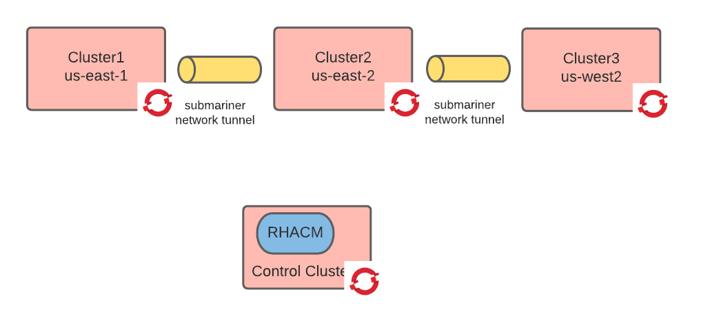

# Cluster preparation

In this step of the tutorial we ae going to stand up the clusters and configure them with a global load balancer and a network tunnel.
This step has the following prerequisites:

1. a running OCP cluster deployed in AWS. This cluster will become the control cluster. You need to be logged-in in it as an administrator.
2. proper aws credentials and quotas to deploy on the NA AWS regions.
3. a ssh key and a OCP pull secret.

## Deploy RHACM

[Red Hat Advanced Cluster Management](https://www.redhat.com/en/technologies/management/advanced-cluster-management) allows among other things to declaratively manage the cluster's lifecycle.

```shell
oc new-project open-cluster-management
oc apply -f ./acm/operator.yaml -n open-cluster-management
oc apply -f ./acm/acm.yaml -n open-cluster-management
oc apply -f ./acm/clusterset.yaml
```

RHACM requires significant resources, check that the RHACM pods are not stuck in `container creating` and nodes if needed.
Wait until all pods are started successfully.

## Create three managed clusters

Prepare some variables

```shell
export ssh_key=$(cat ~/.ssh/ocp_rsa | sed 's/^/  /')
export ssh_pub_key=$(cat ~/.ssh/ocp_rsa.pub)
export pull_secret=$(cat ~/git/openshift-enablement-exam/4.0/pullsecret.json)
export gcp_sa_json=$(cat ~/.gcp/osServiceAccount.json | sed 's/^/  /')
export gcp_project_id=$(cat ~/.gcp/osServiceAccount.json | jq -r .project_id)
export base_domain=$(oc get dns cluster -o jsonpath='{.spec.baseDomain}')
export base_domain=${base_domain#*.}
export cluster_release_image=quay.io/openshift-release-dev/ocp-release:$(oc get clusteroperator config-operator -o jsonpath='{.status.versions[0].version}')-x86_64
```

create clusters

```shell
export region="us-east4"
export network_cidr="10.128.0.0/14"
export service_cidr="172.30.0.0/16"
export node_cidr="10.0.0.0/16"
envsubst < ./acm/gcp-acm-cluster-values.yaml > /tmp/values.yaml
helm upgrade cluster1 ./charts/acm-gcp-cluster --atomic --create-namespace -i -n cluster1  -f /tmp/values.yaml

export region="us-central1"
export network_cidr="10.132.0.0/14"
export service_cidr="172.31.0.0/16"
export node_cidr="10.1.0.0/16"
envsubst < ./acm/gcp-acm-cluster-values.yaml > /tmp/values.yaml
helm upgrade cluster2 ./charts/acm-gcp-cluster --atomic --create-namespace -i -n cluster2  -f /tmp/values.yaml

export region="us-west4"
export network_cidr="10.136.0.0/14"
export service_cidr="172.32.0.0/16"
export node_cidr="10.2.0.0/16"
envsubst < ./acm/gcp-acm-cluster-values.yaml > /tmp/values.yaml
helm upgrade cluster3 ./charts/acm-gcp-cluster --atomic --create-namespace -i -n cluster3  -f /tmp/values.yaml
```

Wait until the clusters are ready (about 40 minutes). You can watch the progress with the following command:

```shell
watch oc get clusterdeployment --all-namespaces
```

At this point your architecture should look like the below image:



Collect the cluster metadata. This is useful if something goes wrong and you need to force the deletion of the clusters.

```shell
for cluster in cluster1 cluster2 cluster3; do
  export cluster_name=$(oc get secret ${cluster}-install-config -n ${cluster} -o jsonpath='{.data.install-config\.yaml}' | base64 -d | yq -r .metadata.name )
  export cluster_id=$(oc get clusterdeployment ${cluster} -n ${cluster} -o jsonpath='{.spec.clusterMetadata.clusterID}')
  export region=$(oc get clusterdeployment ${cluster} -n ${cluster} -o jsonpath='{.spec.platform.gcp.region}')
  export infra_id=$(oc get clusterdeployment ${cluster} -n ${cluster} -o jsonpath='{.spec.clusterMetadata.infraID}')
  export gcp_project_id=$(cat ~/.gcp/osServiceAccount.json | jq -r .project_id)
  envsubst < ./acm/metadata-gcp.tpl.json > ./${cluster}-metadata.json
done
```

### Prepare login config contexts

```shell
export control_cluster=$(oc config current-context)
for cluster in cluster1 cluster2 cluster3; do
  password=$(oc --context ${control_cluster} get secret $(oc --context ${control_cluster} get clusterdeployment ${cluster} -n ${cluster} -o jsonpath='{.spec.clusterMetadata.adminPasswordSecretRef.name}') -n ${cluster} -o jsonpath='{.data.password}' | base64 -d)
  url=$(oc --context ${control_cluster} get clusterdeployment ${cluster} -n ${cluster} -o jsonpath='{.status.apiURL}')
  console_url=$(oc --context ${control_cluster} get clusterdeployment ${cluster} -n ${cluster} -o jsonpath='{.status.webConsoleURL}')
  oc login -u kubeadmin -p ${password} --insecure-skip-tls-verify=true ${url}
  oc config set-cluster ${cluster} --insecure-skip-tls-verify=true --server ${url}
  oc config set-credentials admin-${cluster} --token $(oc whoami -t)
  oc config set-context $cluster --cluster ${cluster} --user=admin-${cluster}
  echo cluster: ${cluster}
  echo api url: ${url}
  echo console url ${console_url}
  echo admin account: kubeadmin/${password}
  export ${cluster}=$cluster
done
oc config use-context ${control_cluster}
```

If you are already logged in you can just do

```shell
export cluster1=cluster1
export cluster2=cluster2
export cluster3=cluster3
```

Now the `${cluster1}`,`${cluster2}` and `${cluster3}` variables contain the kube context to be used to connect to the respective clusters.

### Prepare nodes for wireguard

Procure an entitlement, this can usually be done in the customer portals: Systems->Subscriptions->Download.
Extract the archive and move the file in `export/entitlement_certificates/*.pem` to the `./entitlements` folder.
Also explained [here] (https://www.openshift.com/blog/how-to-use-entitled-image-builds-to-build-drivercontainers-with-ubi-on-openshift).

```shell
export entitlement_file=$(ls ./wireguard/entitlements/*.pem)
base64 -w0 ${entitlement_file} > /tmp/base64_entitlement
sed  "s/BASE64_ENCODED_PEM_FILE/$(cat /tmp/base64_entitlement)/g" ./wireguard/entitlement.yaml > /tmp/entitlement.yaml
for cluster in ${cluster1} ${cluster2} ${cluster3}; do
  oc --context ${cluster} apply -f /tmp/entitlement.yaml
  oc --context ${cluster} new-project wireguard
  oc --context ${cluster} delete configmap module-injection -n wireguard
  oc --context ${cluster} create configmap module-injection --from-file=./wireguard/module-injection.sh -n wireguard
  oc --context ${cluster} adm policy add-scc-to-user privileged -z default -n wireguard
  oc --context ${cluster} apply -f ./wireguard/wireguard-ds-node.yaml -n wireguard
done
```

```shell
for context in ${cluster1} ${cluster2} ${cluster3}; do
  oc --context ${context} rollout restart daemonset -n wireguard
done
```

### VPC Peering

```shell
export gcp_project_id=$(cat ~/.gcp/osServiceAccount.json | jq -r .project_id)
export network_1=$(oc --context cluster1 get infrastructure cluster -o jsonpath='{.status.infrastructureName}')-network
export network_2=$(oc --context cluster2 get infrastructure cluster -o jsonpath='{.status.infrastructureName}')-network
export network_3=$(oc --context cluster3 get infrastructure cluster -o jsonpath='{.status.infrastructureName}')-network

# 1-2
gcloud compute networks peerings create peer-12 --network ${network_1} --peer-project ${gcp_project_id} --peer-network ${network_2} --import-custom-routes --export-custom-routes
gcloud compute networks peerings create peer-21 --network ${network_2} --peer-project ${gcp_project_id} --peer-network ${network_1} --import-custom-routes --export-custom-routes

# 1-3
gcloud compute networks peerings create peer-13 --network ${network_1} --peer-project ${gcp_project_id} --peer-network ${network_3} --import-custom-routes --export-custom-routes
gcloud compute networks peerings create peer-31 --network ${network_3} --peer-project ${gcp_project_id} --peer-network ${network_1} --import-custom-routes --export-custom-routes

# 2-3
gcloud compute networks peerings create peer-23 --network ${network_2} --peer-project ${gcp_project_id} --peer-network ${network_3} --import-custom-routes --export-custom-routes
gcloud compute networks peerings create peer-32 --network ${network_3} --peer-project ${gcp_project_id} --peer-network ${network_2} --import-custom-routes --export-custom-routes
```

Create firewall rules for submariner

```shell
export infrastructure_1=$(oc --context cluster1 get infrastructure cluster -o jsonpath='{.status.infrastructureName}')
export infrastructure_2=$(oc --context cluster2 get infrastructure cluster -o jsonpath='{.status.infrastructureName}')
export infrastructure_3=$(oc --context cluster3 get infrastructure cluster -o jsonpath='{.status.infrastructureName}')
gcloud compute firewall-rules create --network ${infrastructure_1}-network --target-tags ${infrastructure_1}-worker --direction Ingress --source-ranges 0.0.0.0/0 --allow tcp:4800,udp:500,udp:4500,udp:4800,esp ${infrastructure_1}-submariner-in
gcloud compute firewall-rules create --network ${infrastructure_2}-network --target-tags ${infrastructure_2}-worker --direction Ingress --source-ranges 0.0.0.0/0 --allow tcp:4800,udp:500,udp:4500,udp:4800,esp ${infrastructure_2}-submariner-in
gcloud compute firewall-rules create --network ${infrastructure_3}-network --target-tags ${infrastructure_3}-worker --direction Ingress --source-ranges 0.0.0.0/0 --allow tcp:4800,udp:500,udp:4500,udp:4800,esp ${infrastructure_3}-submariner-in

gcloud compute firewall-rules create --network ${infrastructure_1}-network --direction OUT --destination-ranges 0.0.0.0/0 --allow tcp:4800,udp:500,udp:4500,udp:4800,esp ${infrastructure_1}-submariner-out
gcloud compute firewall-rules create --network ${infrastructure_2}-network --direction OUT --destination-ranges 0.0.0.0/0 --allow tcp:4800,udp:500,udp:4500,udp:4800,esp ${infrastructure_2}-submariner-out
gcloud compute firewall-rules create --network ${infrastructure_3}-network --direction OUT --destination-ranges 0.0.0.0/0 --allow tcp:4800,udp:500,udp:4500,udp:4800,esp ${infrastructure_3}-submariner-out
```

### Install submariner manually

```bash
curl -Ls https://get.submariner.io | VERSION=devel bash
oc config use-context ${control_cluster}
subctl deploy-broker
mv broker-info.subm /tmp/broker-info.subm
for context in ${cluster1} ${cluster2} ${cluster3}; do
  subctl join  /tmp/broker-info.subm --kubecontext=${context} --label-gateway=false --clusterid=${context} --cable-driver=vxlan --natt=false
done
```

### verify submariner installation

```shell
#curl -Ls https://get.submariner.io | VERSION=0.8.1 bash
for context in ${cluster1} ${cluster2} ${cluster3}; do
  subctl --kubeconfig ~/Downloads/${context}-kubeconfig.yaml show all
done
oc config use-context ${control_cluster}
```

## Deploy global-load-balancer-operator

The [global-load-balancer-operator](https://github.com/redhat-cop/global-load-balancer-operator#global-load-balancer-operator) programs route53 based on the global routes found on the managed clusters.

### Create global zone

This will create a global zone called `global.<cluster-base-domain>` with associated zone delegation.

```shell
export cluster_base_domain=$(oc --context ${control_cluster} get dns cluster -o jsonpath='{.spec.baseDomain}')
export base_domain=${cluster_base_domain#*.}
export base_domain_zone=$(gcloud --format json dns managed-zones list --filter dnsName=${base_domain}. | jq -r .[].name)
export global_base_domain=global.${cluster_base_domain#*.}
export global_base_domain_no_dots=$(echo ${global_base_domain} | tr '.' '-')
gcloud dns managed-zones create ${global_base_domain_no_dots} --description="Raffa multicluster zone" --dns-name=${global_base_domain} --visibility=public
export ns_record_data=$(gcloud dns record-sets list -z ${global_base_domain_no_dots} --name ${global_base_domain}. --type NS | awk '(NR>1)' | awk '{print $4}')
gcloud dns record-sets create ${global_base_domain} --rrdatas=${ns_record_data} --type=NS -z ${base_domain_zone}
```

### Deploy operator

```shell
export namespace=global-load-balancer-operator
oc --context ${control_cluster} new-project ${namespace}
oc --context ${control_cluster} apply -f ./global-load-balancer-operator/operator.yaml -n ${namespace}
export cluster_base_domain=$(oc --context ${control_cluster} get dns cluster -o jsonpath='{.spec.baseDomain}')
export base_domain=${cluster_base_domain#*.}
export global_base_domain=global.${cluster_base_domain#*.}
export gcp_project_id=$(cat ~/.gcp/osServiceAccount.json | jq -r .project_id)
envsubst < ./global-load-balancer-operator/external-dns-gcp.yaml | oc --context ${control_cluster} apply -f - -n ${namespace}
```

### Deploy global dns configuration for route53

```shell
export cluster1_service_name=router-default
export cluster2_service_name=router-default
export cluster3_service_name=router-default
export cluster1_service_namespace=openshift-ingress
export cluster2_service_namespace=openshift-ingress
export cluster3_service_namespace=openshift-ingress
export cluster1_secret_name=$(oc --context ${control_cluster} get clusterdeployment cluster1 -n cluster1 -o jsonpath='{.spec.clusterMetadata.adminKubeconfigSecretRef.name}')
export cluster2_secret_name=$(oc --context ${control_cluster} get clusterdeployment cluster2 -n cluster2 -o jsonpath='{.spec.clusterMetadata.adminKubeconfigSecretRef.name}')
export cluster3_secret_name=$(oc --context ${control_cluster} get clusterdeployment cluster3 -n cluster3 -o jsonpath='{.spec.clusterMetadata.adminKubeconfigSecretRef.name}')
```

```shell
export namespace=global-load-balancer-operator
export cluster_base_domain=$(oc --context ${control_cluster} get dns cluster -o jsonpath='{.spec.baseDomain}')
export cluster_zone_id=$(oc --context ${control_cluster} get dns cluster -o jsonpath='{.spec.publicZone.id}')
export global_base_domain=global.${cluster_base_domain#*.}
export global_zone_res=$(aws route53 list-hosted-zones-by-name --dns-name ${global_base_domain} | jq -r .HostedZones[0].Id )
export global_zone_id=${global_zone_res##*/}
envsubst < ./global-load-balancer-operator/route53-dns-zone.yaml | oc --context ${control_cluster} apply -f -
envsubst < ./global-load-balancer-operator/route53-global-route-discovery.yaml | oc --context ${control_cluster} apply -f - -n ${namespace}
```

At this point your architecture should look like the below image:


## Troubleshooting Submariner

## Performance test

```shell
subctl benchmark throughput ~/Downloads/cluster1-kubeconfig.yaml ~/Downloads/cluster2-kubeconfig.yaml
subctl benchmark throughput ~/Downloads/cluster2-kubeconfig.yaml ~/Downloads/cluster1-kubeconfig.yaml
subctl benchmark throughput ~/Downloads/cluster2-kubeconfig.yaml ~/Downloads/cluster3-kubeconfig.yaml
subctl benchmark throughput ~/Downloads/cluster3-kubeconfig.yaml ~/Downloads/cluster2-kubeconfig.yaml
subctl benchmark throughput ~/Downloads/cluster3-kubeconfig.yaml ~/Downloads/cluster1-kubeconfig.yaml
subctl benchmark throughput ~/Downloads/cluster1-kubeconfig.yaml ~/Downloads/cluster3-kubeconfig.yaml

subctl benchmark latency ~/Downloads/cluster1-kubeconfig.yaml ~/Downloads/cluster2-kubeconfig.yaml
subctl benchmark latency ~/Downloads/cluster2-kubeconfig.yaml ~/Downloads/cluster3-kubeconfig.yaml
subctl benchmark latency ~/Downloads/cluster3-kubeconfig.yaml ~/Downloads/cluster1-kubeconfig.yaml
```

### Network performance tests

```shell
for context in ${cluster1} ${cluster2} ${cluster3}; do
  oc --context ${context} new-project network-test
  oc --context ${context} adm policy add-scc-to-user privileged -z default -n network-test
  oc --context ${context} apply -f ./iperf/iperf-deployment.yaml -n network-test
done
```

### Restarting submariner pods

```shell
for context in ${cluster1} ${cluster2} ${cluster3}; do
  oc --context ${context} rollout restart daemonset -n submariner-operator
  oc --context ${context} rollout restart deployment -n submariner-operator
done
```

### Uninstalling submariner

```shell
for context in ${cluster1} ${cluster2} ${cluster3}; do
  oc --context ${context} delete project submariner-operator
done
oc --context ${control_cluster} delete project submariner-k8s-broker
```

### Install kube-ops-view

This can be useful to quickly troubleshoot issues

```shell
for context in ${cluster1} ${cluster2} ${cluster3}; do
  export OCP_OPS_VIEW_ROUTE=ocp-ops-view.apps.$(oc --context ${context} get dns cluster -o jsonpath='{.spec.baseDomain}')
  oc --context ${context} adm policy add-scc-to-user anyuid -z default -n ocp-ops-view
  helm --kube-context ${context} upgrade kube-ops-view stable/kube-ops-view -i --create-namespace -n ocp-ops-view --set redis.enabled=true --set rbac.create=true --set ingress.enabled=true --set ingress.hostname=$OCP_OPS_VIEW_ROUTE --set redis.master.port=6379
done
```

## Cleaning up

If you need to uninstall the clusters, run the following:

```shell
for cluster in cluster1 cluster2 cluster3; do
  oc delete clusterdeployment ${cluster} -n ${cluster}
done
```

if for any reason that does not work, run the following:

```shell
for cluster in cluster1 cluster2 cluster3; do
  mkdir -p ./${cluster}
  cp ${cluster}-metadata.json ./${cluster}/metadata.json
  openshift-install  destroy cluster --log-level=debug --dir ./${cluster}
done
```

```shell
for cluster in cluster1 cluster2 cluster3; do
  helm uninstall ${cluster} -n ${cluster}
  oc delete project ${cluster}
done
```
