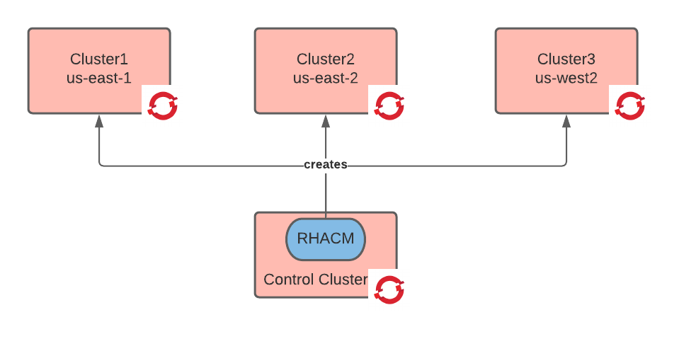
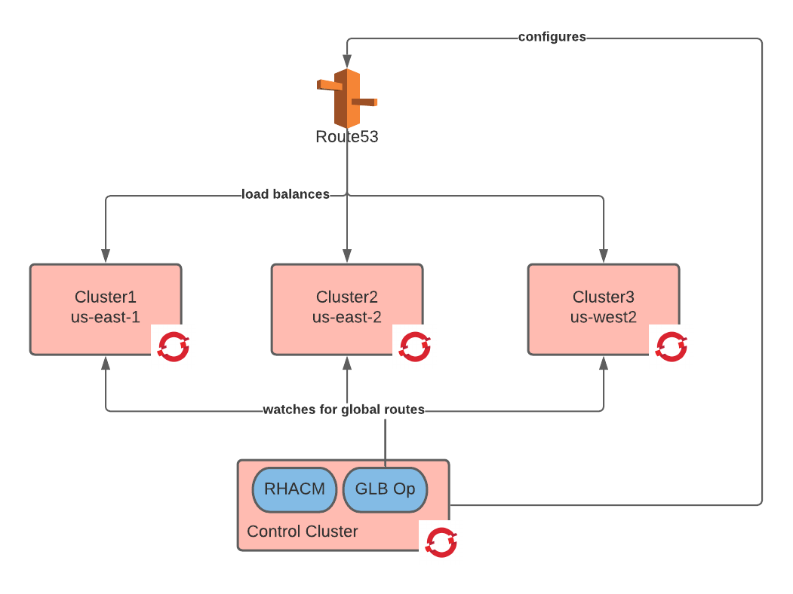

# Cluster preparation

In this step of the tutorial we ae going to stand up the clusters and configure them with a global load balancer and a network tunnel.
This step has the following prerequisites:

1. a running OCP cluster deployed in AWS. This cluster will become the control cluster. You need to be logged-in in it as an administrator.
2. proper aws credentials and quotas to deploy on the NA AWS regions.
3. a ssh key and a OCP pull secret.

## Deploy RHACM

[Red Hat Advanced Cluster Management](https://www.redhat.com/en/technologies/management/advanced-cluster-management) allows among other things to declaratively manage the cluster's lifecycle.

```shell
oc new-project open-cluster-management
oc apply -f ./acm/operator.yaml -n open-cluster-management
oc apply -f ./acm/acm.yaml -n open-cluster-management
```

RHACM requires significant resources, check that the RHACM pods are not stuck in `container creating` and nodes if needed.
Wait until all pods are started successfully.

## Create three managed clusters

Prepare some variables

```shell
export ssh_key=$(cat ~/.ssh/ocp_rsa | sed 's/^/  /')
export ssh_pub_key=$(cat ~/.ssh/ocp_rsa.pub)
export pull_secret=$(cat ~/git/openshift-enablement-exam/4.0/pullsecret.json)
export aws_id=$(cat ~/.aws/credentials | grep aws_access_key_id | cut -d'=' -f 2)
export aws_key=$(cat ~/.aws/credentials | grep aws_secret_access_key | cut -d'=' -f 2)
export base_domain=$(oc get dns cluster -o jsonpath='{.spec.baseDomain}')
export base_domain=${base_domain#*.}
export cluster_release_image=quay.io/openshift-release-dev/ocp-release:$(oc get clusteroperator config-operator -o jsonpath='{.status.versions[0].version}')-x86_64
```

create clusters

```shell
export region="us-east-1"
export network_cidr="10.128.0.0/14"
export service_cidr="172.30.0.0/16"
envsubst < ./acm/acm-cluster-values.yaml > /tmp/values.yaml
helm upgrade cluster1 ./charts/acm-aws-cluster --create-namespace -i -n cluster1  -f /tmp/values.yaml

export region="us-east-2"
export network_cidr="10.132.0.0/14"
export service_cidr="172.31.0.0/16"
envsubst < ./acm/acm-cluster-values.yaml > /tmp/values.yaml
helm upgrade cluster2 ./charts/acm-aws-cluster --create-namespace -i -n cluster2  -f /tmp/values.yaml

export region="us-west-2"
export network_cidr="10.136.0.0/14"
export service_cidr="172.32.0.0/16"
envsubst < ./acm/acm-cluster-values.yaml > /tmp/values.yaml
helm upgrade cluster3 ./charts/acm-aws-cluster --create-namespace -i -n cluster3  -f /tmp/values.yaml
```

Wait until the clusters are ready (about 40 minutes). You can watch the progress with the following command:

```shell
watch oc get clusterdeployment --all-namespaces
```

At this point your architecture should look like the below image:



Collect the cluster metadata. This is useful if something goes wrong and you need to force the deletion of the clusters.

```shell
for cluster in cluster1 cluster2 cluster3; do
  export cluster_name=$(oc get secret ${cluster}-install-config -n ${cluster} -o jsonpath='{.data.install-config\.yaml}' | base64 -d | yq -r .metadata.name )
  export cluster_id=$(oc get clusterdeployment ${cluster} -n ${cluster} -o jsonpath='{.spec.clusterMetadata.clusterID}')
  export region=$(oc get clusterdeployment ${cluster} -n ${cluster} -o jsonpath='{.spec.platform.aws.region}')
  export infra_id=$(oc get clusterdeployment ${cluster} -n ${cluster} -o jsonpath='{.spec.clusterMetadata.infraID}')
  envsubst < ./acm/metadata.tpl.json > ./${cluster}-metadata.json
done
```

### Prepare login config contexts

```shell
export control_cluster=$(oc config current-context)
for cluster in cluster1 cluster2 cluster3; do
  password=$(oc --context ${control_cluster} get secret $(oc --context ${control_cluster} get clusterdeployment ${cluster} -n ${cluster} -o jsonpath='{.spec.clusterMetadata.adminPasswordSecretRef.name}') -n ${cluster} -o jsonpath='{.data.password}' | base64 -d)
  url=$(oc --context ${control_cluster} get clusterdeployment ${cluster} -n ${cluster} -o jsonpath='{.status.apiURL}')
  console_url=$(oc --context ${control_cluster} get clusterdeployment ${cluster} -n ${cluster} -o jsonpath='{.status.webConsoleURL}')
  oc login -u kubeadmin -p ${password} --insecure-skip-tls-verify=true ${url}
  oc config set-cluster ${cluster} --insecure-skip-tls-verify=true --server ${url}
  oc config set-credentials admin-${cluster} --token $(oc whoami -t)
  oc config set-context $cluster --cluster ${cluster} --user=admin-${cluster}
  echo cluster: ${cluster}
  echo api url: ${url}
  echo console url ${console_url}
  echo admin account: kubeadmin/${password}
  export ${cluster}=$cluster
done
oc config use-context ${control_cluster}
```

Now the `${cluster1}`,`${cluster2}` and `${cluster3}` variables contain the kube context to be used to connect to the respective clusters.

## Deploy global-load-balancer-operator

The [global-load-balancer-operator](https://github.com/redhat-cop/global-load-balancer-operator#global-load-balancer-operator) programs route53 based on the global routes found on the managed clusters.

### Create global zone

This will create a global zone called `global.<cluster-base-domain>` with associated zone delegation.

```shell
export cluster_base_domain=$(oc --context ${control_cluster} get dns cluster -o jsonpath='{.spec.baseDomain}')
export cluster_zone_id=$(oc --context ${control_cluster} get dns cluster -o jsonpath='{.spec.publicZone.id}')
export global_base_domain=global.${cluster_base_domain#*.}
aws route53 create-hosted-zone --name ${global_base_domain} --caller-reference $(date +"%m-%d-%y-%H-%M-%S-%N")
export global_zone_res=$(aws route53 list-hosted-zones-by-name --dns-name ${global_base_domain} | jq -r .HostedZones[0].Id )
export global_zone_id=${global_zone_res##*/}
export delegation_record=$(aws route53 list-resource-record-sets --hosted-zone-id ${global_zone_id} | jq .ResourceRecordSets[0])
envsubst < ./global-load-balancer-operator/delegation-record.json > /tmp/delegation-record.json
aws route53 change-resource-record-sets --hosted-zone-id ${cluster_zone_id} --change-batch file:///tmp/delegation-record.json
```

### Deploy operator

```shell
export namespace=global-load-balancer-operator
oc --context ${control_cluster} new-project ${namespace}
oc --context ${control_cluster} apply -f https://raw.githubusercontent.com/kubernetes-sigs/external-dns/master/docs/contributing/crd-source/crd-manifest.yaml
oc --context ${control_cluster} apply -f ./global-load-balancer-operator/operator.yaml -n ${namespace}
```

### Deploy global dns configuration for route53

```shell
export cluster1_service_name=router-default
export cluster2_service_name=router-default
export cluster3_service_name=router-default
export cluster1_service_namespace=openshift-ingress
export cluster2_service_namespace=openshift-ingress
export cluster3_service_namespace=openshift-ingress
export cluster1_secret_name=$(oc --context ${control_cluster} get clusterdeployment cluster1 -n cluster1 -o jsonpath='{.spec.clusterMetadata.adminKubeconfigSecretRef.name}')
export cluster2_secret_name=$(oc --context ${control_cluster} get clusterdeployment cluster2 -n cluster2 -o jsonpath='{.spec.clusterMetadata.adminKubeconfigSecretRef.name}')
export cluster3_secret_name=$(oc --context ${control_cluster} get clusterdeployment cluster3 -n cluster3 -o jsonpath='{.spec.clusterMetadata.adminKubeconfigSecretRef.name}')
```

```shell
envsubst < ./global-load-balancer-operator/route53-credentials-request.yaml | oc --context ${control_cluster} apply -f - -n ${namespace}
envsubst < ./global-load-balancer-operator/route53-dns-zone.yaml | oc --context ${control_cluster} apply -f -
envsubst < ./global-load-balancer-operator/route53-global-route-discovery.yaml | oc --context ${control_cluster} apply -f - -n ${namespace}
```

At this point your architecture should look like the below image:



## Deploy Submariner

[Submariner](https://submariner.io/) creates an IPSec-based network tunnel between the managed clusters' SDNs.

### Prepare nodes for submariner

```shell
git -C /tmp clone https://github.com/submariner-io/submariner
for context in ${cluster1} ${cluster2} ${cluster3}; do
  cluster_id=$(oc --context ${context} get infrastructure cluster -o jsonpath='{.status.infrastructureName}')
  cluster_region=$(oc --context ${context} get infrastructure cluster -o jsonpath='{.status.platformStatus.aws.region}')
  echo $cluster_id $cluster_region
  mkdir -p /tmp/${cluster_id}
  cp -R /tmp/submariner/tools/openshift/ocp-ipi-aws/* /tmp/${cluster_id}
  sed -i "s/\"cluster_id\"/\"${cluster_id}\"/g" /tmp/${cluster_id}/main.tf
  sed -i "s/\"aws_region\"/\"${cluster_region}\"/g" /tmp/${cluster_id}/main.tf
  pushd /tmp/${cluster_id}
  terraform init -upgrade=true
  terraform apply -auto-approve
  popd
  oc --context=${context} apply -f /tmp/${cluster_id}/submariner-gw-machine*.yaml
done
```

<!--
### Deploy submariner via helm chart (do not use, it doesn't work)

```shell
helm repo add submariner-latest https://submariner-io.github.io/submariner-charts/charts
```

Deploy the broker

```shell
oc --context ${control_cluster} new-project submariner-broker
oc --context ${control_cluster} apply -f ./submariner/submariner-crds.yaml
helm upgrade submariner-broker submariner-latest/submariner-k8s-broker --kube-context ${control_cluster} -i --create-namespace -f ./submariner/values-sm-broker.yaml -n submariner-broker
```

Deploy submariner

```shell
export broker_api=${$(oc --context ${control_cluster} get infrastructure cluster -o jsonpath='{.status.apiServerURL}')#"https"}
export broker_api=${broker_api#"https://"}
#$(oc --context ${control_cluster} -n default get endpoints kubernetes -o jsonpath="{.subsets[0].addresses[0].ip}:{.subsets[0].ports[?(@.name=='https')].port}")
export broker_ca=$(oc --context ${control_cluster} get secret $(oc --context ${control_cluster} get sa default -n default -o yaml | grep token | awk '{print $3}') -n default -o jsonpath='{.data.ca\.crt}')
export broker_token=$(oc --context ${control_cluster} get secret $(oc --context ${control_cluster} get sa submariner-broker-submariner-k8s-broker-client -n submariner-broker -o yaml | grep token | awk '{print $3}') -n submariner-broker -o jsonpath='{.data.token}' | base64 -d)
export SUBMARINER_PSK=$(cat /dev/urandom | LC_CTYPE=C tr -dc 'a-zA-Z0-9' | fold -w 64 | head -n 1)
for context in ${cluster1} ${cluster2} ${cluster3}; do
  export cluster_cidr=$(oc --context ${context} get network cluster -o jsonpath='{.status.clusterNetwork[0].cidr}')
  export cluster_service_cidr=$(oc --context ${context} get network cluster -o jsonpath='{.status.serviceNetwork[0]}')
  export cluster_id=$(oc --context ${context} get infrastructure cluster -o jsonpath='{.status.infrastructureName}')
  oc --context ${context} apply -f ./submariner/submariner-crds.yaml
  envsubst < ./submariner/values-sm.yaml > /tmp/values-sm.yaml
  #helm upgrade submariner submariner-latest/submariner --kube-context ${context} -i --create-namespace -f /tmp/values-sm.yaml -n submariner
  oc --context ${context} new-project submariner
  oc --context ${context} adm policy add-scc-to-user privileged -z submariner-engine -n submariner
  oc --context ${context} adm policy add-scc-to-user privileged -z submariner-routeagent -n submariner
  helm template submariner ./charts/submariner --kube-context ${context} --create-namespace -f /tmp/values-sm.yaml -n submariner | oc --context ${context} apply -f - -n submariner
done
```
-->

### Deploy submariner via CLI

```shell
curl -Ls https://get.submariner.io | VERSION=devel bash
subctl deploy-broker --kubecontext ${control_cluster} --service-discovery
mv broker-info.subm /tmp/broker-info.subm
for context in ${cluster1} ${cluster2} ${cluster3}; do
  subctl join --kubecontext ${context} /tmp/broker-info.subm --no-label --clusterid $(echo ${context} | cut -d "/" -f2 | cut -d "-" -f2) --version devel --cable-driver libreswan
done
```

verify submariner

```shell
for context in ${cluster1} ${cluster2} ${cluster3}; do
  subctl show --kubecontext ${context} all
done
```

At this point your architecture should look like the below image:


verify submariner performance

```shell
for context_from in ${cluster1} ${cluster2} ${cluster3}; do
  for context_to in ${cluster1} ${cluster2} ${cluster3}; do
    if [ ${context_from} != ${context_to} ]; then
      oc config use-context ${context_from}
      cp ~/.kube/config /tmp/config-from
      oc config use-context ${context_to}
      cp ~/.kube/config /tmp/config-to
      subctl benchmark latency /tmp/config-from /tmp/config-to
      subctl benchmark throughput /tmp/config-from /tmp/config-to
    fi
  done
done
oc config use-context ${control_cluster}
```

## Troubleshooting Submariner

### Restarting submariner pods

```shell
for context in ${cluster1} ${cluster2} ${cluster3}; do
  oc --context ${context} rollout restart daemonset -n submariner-operator
  oc --context ${context} rollout restart deployment -n submariner-operator
done
```

### Uninstalling submariner

```shell
for context in ${cluster1} ${cluster2} ${cluster3}; do
  oc --context ${context} delete project submariner-operator
done
oc --context ${control_cluster} delete project submariner-k8s-broker
```

### Install kube-ops-view

This can be useful to quickly troubleshoot issues

```shell
for context in ${cluster1} ${cluster2} ${cluster3}; do
  export OCP_OPS_VIEW_ROUTE=ocp-ops-view.apps.$(oc --context ${context} get dns cluster -o jsonpath='{.spec.baseDomain}')
  helm --kube-context ${context} upgrade kube-ops-view stable/kube-ops-view -i --create-namespace -n ocp-ops-view --set redis.enabled=true --set rbac.create=true --set ingress.enabled=true --set ingress.hostname=$OCP_OPS_VIEW_ROUTE --set redis.master.port=6379
  oc --context ${context} adm policy add-scc-to-user anyuid -z default -n ocp-ops-view
done
```

## Cleaning up

If you need to uninstall the clusters, run the following:

```shell
for cluster in cluster1 cluster2 cluster3; do
  oc delete clusterdeployment ${cluster} -n ${cluster}
done
```

if for any reason that does not work, run the following:

```shell
for cluster in cluster1 cluster2 cluster3; do
  mkdir -p ./${cluster}
  cp ${cluster}-metadata.json ./${cluster}/medatada.json
  openshift-install  destroy cluster --log-level=debug --dir ./${cluster}
done
```
