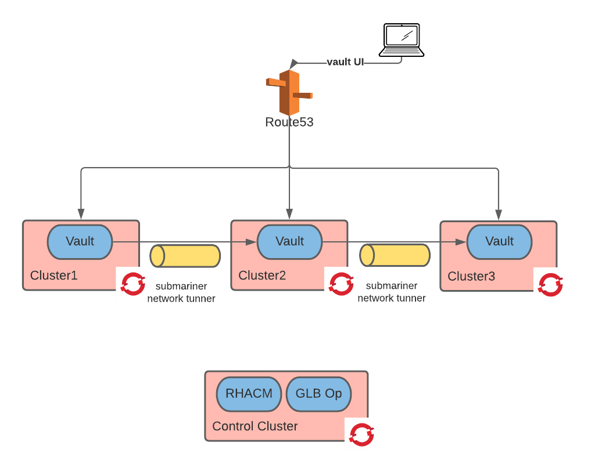

# Establishing Trust

We need to establish some form of trust between the cluster before starting to deploy stateful workloads.
In practice this means that the applications deployed to these clusters will have a common source for their secrets, certificates and credentials in general.
In this step we are going to use Vault as our secret manager and we are going to deploy Vault in these cluster themselves.

## Deploy Vault

### Create vault unseal key with aws KMS

```shell
export region=$(oc --context ${control_cluster} get infrastructure cluster -o jsonpath='{.status.platformStatus.aws.region}')
export key_id=$(aws --region ${region} kms create-key --description "used by vault" | jq -r .KeyMetadata.KeyId)
aws --region ${region} kms tag-resource --key-id ${key_id} --tags TagKey=name,TagValue=vault-key
oc --context ${control_cluster} new-project vault
oc --context ${control_cluster} create secret generic vault-kms -n vault --from-literal=key_id=${key_id}
```

### Create vault unseal key with google KMS

```shell
gcloud kms keyrings create "acm" --location "global"
gcloud kms keys create "vault" --location "global" --keyring "acm" --purpose "encryption"
```

### Create vault unseal key with azure KMS

```shell
export region=$(oc --context ${control_cluster} get machine -n openshift-machine-api -o jsonpath='{.items[0].metadata.labels.machine\.openshift\.io/region}')
export resourceGroupName=$(oc --context ${control_cluster} get infrastructure cluster -o jsonpath='{.status.platformStatus.azure.resourceGroupName}')
export app_id=$(cat ~/.azure/osServicePrincipal.json | jq -r .clientId)
az keyvault create --name "raffa-vault" --resource-group ${resourceGroupName} --location ${region} --enable-soft-delete false
az keyvault set-policy --name "raffa-vault" --spn ${app_id} --key-permissions backup create decrypt delete encrypt get import list purge recover restore sign unwrapKey update verify wrapKey
az keyvault key create --kty RSA --size 2048 --ops unwrapKey verify wrapKey --vault-name "raffa-vault" --name "hashicorp-vault-unseal-key"
```

### Create Vault root certificate

```shell
oc --context ${control_cluster} new-project cert-manager
oc --context ${control_cluster} apply --validate=false -f https://github.com/jetstack/cert-manager/releases/download/v1.7.1/cert-manager.yaml
oc --context ${control_cluster} new-project vault
oc --context ${control_cluster} apply -f ./vault/vault-control-cluster-certs.yaml -n vault
```

### Deploy cert-manager, cert-utils-operator and reloader

```shell
helm repo add stakater https://stakater.github.io/stakater-charts
helm repo update
for context in ${cluster1} ${cluster2} ${cluster3}; do
  oc --context ${context} new-project cert-manager
  oc --context ${context} apply --validate=false -f https://github.com/jetstack/cert-manager/releases/download/v1.7.1/cert-manager.yaml
  oc --context ${context} new-project cert-utils-operator
  oc --context ${context} apply  -f ./cert-utils-operator/operator.yaml -n cert-utils-operator
  oc new-project reloader
  export uid=$(oc --context ${context} get project reloader -o jsonpath='{.metadata.annotations.openshift\.io/sa\.scc\.uid-range}'|sed 's/\/.*//')
  helm --kube-context ${context} upgrade reloader stakater/reloader -i --create-namespace -n reloader --set reloader.deployment.securityContext.runAsUser=${uid}
done
```

### Deploy Vault instances

```shell
export rootca_crt=$(oc --context ${control_cluster} get secret rootca -n vault -o jsonpath='{.data.tls\.crt}')
export rootca_key=$(oc --context ${control_cluster} get secret rootca -n vault -o jsonpath='{.data.tls\.key}')
export cluster_base_domain=$(oc --context ${control_cluster} get dns cluster -o jsonpath='{.spec.baseDomain}')
export global_base_domain=global.${cluster_base_domain#*.}
# allowed values are aws,azure,gcp, by default same as control cluster
export infrastructure=$(oc --context ${control_cluster} get infrastructure cluster -o jsonpath='{.spec.platformSpec.type}'| tr '[:upper:]' '[:lower:]')
case ${infrastructure} in
  aws)
    export region=$(oc --context ${control_cluster} get infrastructure cluster -o jsonpath='{.status.platformStatus.aws.region}')
    export key_id=$(oc --context ${control_cluster} get secret vault-kms -n vault -o jsonpath='{.data.key_id}' | base64 -d )
  ;;
  gcp)
    export gcp_project_id=$(cat ~/.gcp/osServiceAccount.json | jq -r .project_id)
  ;;
  azure)
    export tenantId=$(cat ~/.azure/osServicePrincipal.json | jq -r .tenantId)
    export clientId=$(cat ~/.azure/osServicePrincipal.json | jq -r .clientId)
    export clientSecret=$(cat ~/.azure/osServicePrincipal.json | jq -r .clientSecret)
  ;;
esac
for context in ${cluster1} ${cluster2} ${cluster3}; do
  export cluster=${context}
  envsubst < ./vault/kms-values-${infrastructure}.yaml.template > /tmp/values.yaml
  helm --kube-context ${context} upgrade vault ./charts/vault-multicluster -i --atomic --create-namespace -n vault -f /tmp/values.yaml
done
```

### Initialize Vault (run once-only)

```shell
HA_INIT_RESPONSE=$(oc --context ${cluster1} exec vault-0 -n vault -- vault operator init -address https://vault-0.cluster1.vault-internal.vault.svc.clusterset.local:8200 -ca-path /etc/vault-tls/ca.crt -format=json -recovery-shares 1 -recovery-threshold 1)

HA_UNSEAL_KEY=$(echo "$HA_INIT_RESPONSE" | jq -r .recovery_keys_b64[0])
HA_VAULT_TOKEN=$(echo "$HA_INIT_RESPONSE" | jq -r .root_token)

echo "$HA_UNSEAL_KEY"
echo "$HA_VAULT_TOKEN"

#here we are saving these variable in a secret, this is probably not what you should do in a production environment
oc --context ${control_cluster} create secret generic vault-init -n vault --from-literal=unseal_key=${HA_UNSEAL_KEY} --from-literal=root_token=${HA_VAULT_TOKEN}
```

### Verify Vault Cluster Health

```shell
oc --context ${cluster1} exec vault-0 -n vault -- sh -c "VAULT_TOKEN=${HA_VAULT_TOKEN} vault operator raft list-peers -address https://vault-0.cluster1.vault-internal.vault.svc.clusterset.local:8200 -ca-path /etc/vault-tls/ca.crt"
```

### Testing vault external connectivity

```shell
export VAULT_ADDR=https://vault.${global_base_domain}
export VAULT_TOKEN=$(oc --context ${control_cluster} get secret vault-init -n vault -o jsonpath='{.data.root_token}' | base64 -d )
vault status -tls-skip-verify
```

### Access Vault UI

browse to here

```shell
echo $VAULT_ADDR/ui
```

At this point your architecture should look like the below image:



## Vault cert-manager integration

With this integration we enable the previously installed cert-manager to create certificates via vault.

### Prepare Kubernetes authentication

```shell
export VAULT_ADDR=https://vault.${global_base_domain}
export VAULT_TOKEN=$(oc --context ${control_cluster} get secret vault-init -n vault -o jsonpath='{.data.root_token}'| base64 -d )
for context in ${cluster1} ${cluster2} ${cluster3}; do
  export clusterid=${context}
  vault auth enable -tls-skip-verify -path=kubernetes-${clusterid} kubernetes 
  export sa_secret_name=$(oc --context ${context} get sa vault -n vault -o jsonpath='{.secrets[*].name}' | grep -o '\b\w*\-token-\w*\b')
  export api_url=$(oc --context ${control_cluster} get clusterdeployment ${context} -n ${context} -o jsonpath='{.status.apiURL}')
  oc --context ${context} get secret ${sa_secret_name} -n vault -o jsonpath='{.data.ca\.crt}' | base64 -d > /tmp/ca.crt
  vault write -tls-skip-verify auth/kubernetes-${clusterid}/config token_reviewer_jwt="$(oc --context ${context} serviceaccounts get-token vault -n vault)" kubernetes_host=${api_url} kubernetes_ca_cert=@/tmp/ca.crt
  vault write -tls-skip-verify auth/kubernetes-${clusterid}/role/cert-manager bound_service_account_names=default bound_service_account_namespaces=cert-manager policies=default,cert-manager
done
```

### Prepare vault pki

```shell
export VAULT_ADDR=https://vault.${global_base_domain}
export VAULT_TOKEN=$(oc --context ${control_cluster} get secret vault-init -n vault -o jsonpath='{.data.root_token}'| base64 -d )
vault secrets enable -tls-skip-verify pki
vault secrets tune -tls-skip-verify -max-lease-ttl=87600h pki
vault write -tls-skip-verify pki/root/generate/internal common_name=cert-manager.cluster.local ttl=87600h
vault write -tls-skip-verify pki/config/urls issuing_certificates="http://vault.vault.svc:8200/v1/pki/ca" crl_distribution_points="http://vault.vault.svc:8200/v1/pki/crl"
vault write -tls-skip-verify pki/roles/cert-manager allowed_domains=svc,svc.cluster.local,svc.clusterset.local,node,root,${global_base_domain},yugabyte,keycloak,vault allow_bare_domains=true allow_subdomains=true allow_localhost=false enforce_hostnames=false
vault policy write -tls-skip-verify cert-manager ./vault/cert-manager-policy.hcl
```

### Prepare cert-manager Cluster Issuer

```shell
for context in ${cluster1} ${cluster2} ${cluster3}; do
  export vault_ca=$(oc --context ${context} get secret vault-tls -n vault -o jsonpath='{.data.ca\.crt}')
  export sa_secret_name=$(oc --context ${context} get sa default -n cert-manager -o jsonpath='{.secrets[*].name}' | grep -o '\b\w*\-token-\w*\b')
  export cluster=${context}
  envsubst < ./vault/vault-issuer.yaml | oc --context ${context} apply -f - -n cert-manager
done  
```

## Restart Vault pods

```shell
for context in ${cluster1} ${cluster2} ${cluster3}; do
  oc --context ${context} rollout restart statefulset/vault -n vault
done  
```

```shell
for context in ${cluster1} ${cluster2} ${cluster3}; do
  oc --context ${context} scale statefulset vault -n vault --replicas=0
  oc --context ${context} scale statefulset vault -n vault --replicas=3
done  
```

## Clean up Vault

Use this to clean up vault:

```shell
for context in ${cluster1} ${cluster2} ${cluster3}; do
  helm --kube-context ${context} uninstall vault -n vault
  oc --context ${context} delete pvc data-vault-0 data-vault-1 data-vault-2 -n vault
done  
```
